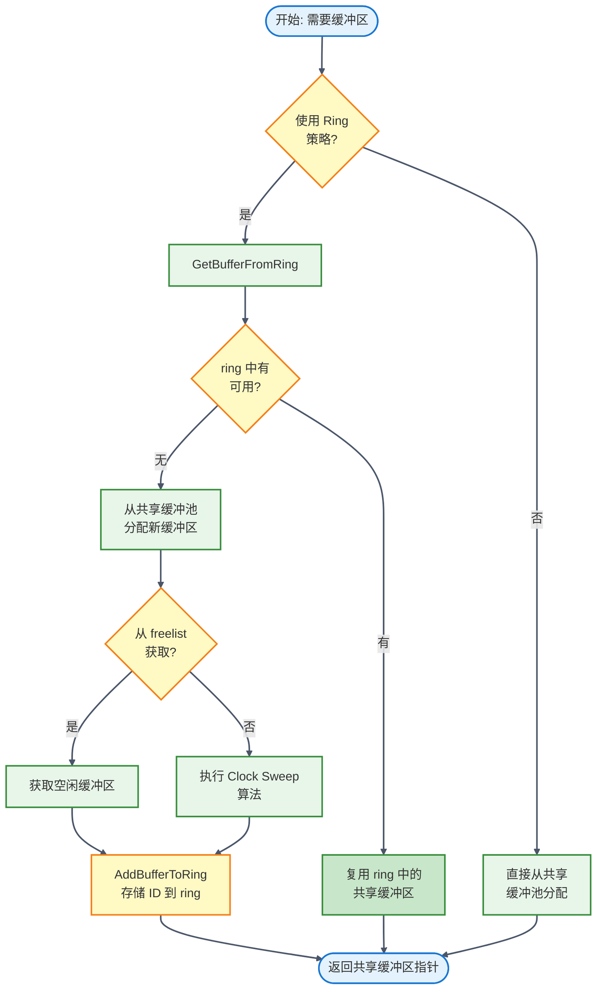
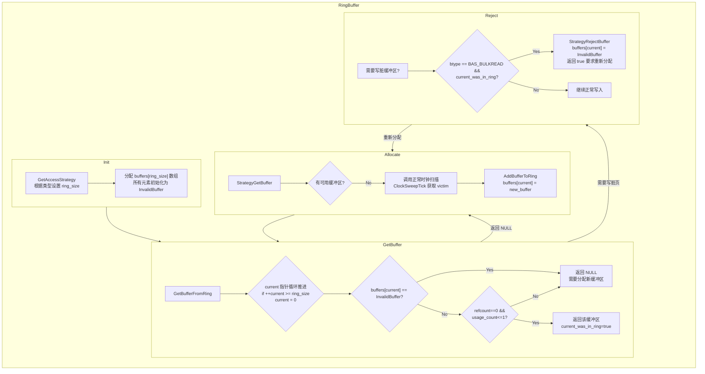
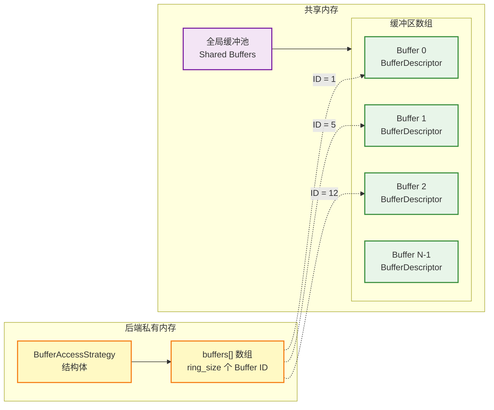

## 1. 概述

### 1.1 什么是 Buffer Ring

PostgreSQL 的 Ring Buffer 是一种**后端私有的缓冲区访问策略**（Buffer Access Strategy），用于优化特定场景下的缓冲区使用。它通过维护一个固定大小的环形缓冲区数组，避免大容量顺序扫描（如 VACUUM、批量读取/写入）污染全局缓冲池。

### 1.2 设计目标

| 目标 | 说明 |
|------|------|
| **避免缓冲区污染** | 大表扫描不应当逐出缓冲池中的热数据 |
| **减少锁竞争** | Ring 是进程私有的，不需要全局锁 |
| **优化批量操作** | 批量读写可以更好地利用局部性原理 |
| **保护正常查询** | VACUUM 等维护操作不应影响业务查询 |

### 1.3 核心思想

传统 Buffer 分配使用全局的 Clock Sweep 算法。当执行大表扫描时，会频繁地逐出缓冲池中的页面，可能导致热数据被冷数据替换。

Buffer Ring 为特定操作分配一个**固定大小的私有缓冲区集合**，使这些操作在**自己的 Ring 内循环使用**，从而保护全局缓冲池。Ring Buffer 本质上是一个**后端私有的 LRU 缓存**，它从共享缓冲池中"借用"一定数量的缓冲区，并在操作期间循环使用这些缓冲区。

---

## 2. 核心数据结构

### 2.1 BufferAccessStrategyData

```c
/* 源文件: src/backend/storage/buffer/freelist.c:71-97 */

/*
 * Private (non-shared) state for managing a ring of shared buffers to re-use.
 * This is currently the only kind of BufferAccessStrategy object, but someday
 * we might have more kinds.
 */
typedef struct BufferAccessStrategyData
{
    /* 整体策略类型 */
    BufferAccessStrategyType btype;

    /* buffers[] 数组中的元素数量（环形大小） */
    int         ring_size;

    /*
     * 环形中"当前"槽位的索引
     * 即最近由 GetBufferFromRing 返回的槽位
     */
    int         current;

    /*
     * 如果 StrategyGetBuffer 刚返回的缓冲区已在环形中，则为 true
     */
    bool        current_was_in_ring;

    /*
     * 缓冲区编号数组
     * InvalidBuffer（即 0）表示尚未为此环形槽位选择缓冲区
     * 为了分配简便，此数组与结构的固定字段一起 palloc
     */
    Buffer      buffers[FLEXIBLE_ARRAY_MEMBER];
}BufferAccessStrategyData;
```

**字段说明**:

| 字段 | 类型 | 说明 |
|------|------|------|
| `btype` | `BufferAccessStrategyType` | 策略类型（NORMAL/BULKREAD/BULKWRITE/VACUUM） |
| `ring_size` | `int` | Ring 的大小（缓冲区数量） |
| `current` | `int` | 当前指针位置，指向下一个要使用的槽位 |
| `current_was_in_ring` | `bool` | 标记当前 buffer 是否来自 ring |
| `buffers[]` | `Buffer[]` | 柔性数组，存储 ring 中的缓冲区编号 |

**BufferAccessStrategyData 内存布局**

**固定字段区域** (偏移 0x00 - 0x0F)
```
+----------------------------+----------------------------+
| 字段名        | 类型     | 偏移  | 大小 |
|----------------------------|----------------------------|
| btype        | enum     | 0x00  | 4B  |
| ring_size    | int      | 0x04  | 4B  |
| current      | int      | 0x08  | 4B  |
| current_was_in_ring | bool | 0x0C  | 4B  |
+----------------------------+----------------------------+
```

**柔性数组区域** (偏移 0x10 起始)
```
+----------------------------+
| buffers[0]                 |
| buffers[1]                 |
| ...                        |
| buffers[ring_size-1]       |
+----------------------------+
    总大小: ring_size × 4B
```

**总内存大小** = `offsetof(BufferAccessStrategyData, buffers) + ring_size × sizeof(Buffer)`

### 2.2 BufferAccessStrategyType 枚举

```c
/* 源文件: src/include/storage/bufmgr.h:27-34 */
/* Possible arguments for GetAccessStrategy() */
typedef enum BufferAccessStrategyType
{
    BAS_NORMAL,      /* 普通随机访问（返回 NULL，使用默认策略）*/
    BAS_BULKREAD,    /* 大型只读扫描（更新 hint bits 是可以的）*/
    BAS_BULKWRITE,   /* 大型多块写入（如 COPY IN）*/
    BAS_VACUUM       /* VACUUM */
} BufferAccessStrategyType;
```

---

## 3. Ring 大小配置

### 3.1 大小计算

```c
/* 源文件: src/backend/storage/buffer/freelist.c:542-588 */
BufferAccessStrategy
GetAccessStrategy(BufferAccessStrategyType btype)
{
    BufferAccessStrategy strategy;
    int         ring_size;

    // 根据类型选择环形大小
    switch (btype)
    {
        case BAS_NORMAL:
            return NULL;  /* 返回 NULL 表示使用默认策略 */

        case BAS_BULKREAD:
            ring_size = 256 * 1024 / BLCKSZ;  // 256KB
            break;
        case BAS_BULKWRITE:
            ring_size = 16 * 1024 * 1024 / BLCKSZ;  // 16MB
            break;
        case BAS_VACUUM:
            ring_size = 256 * 1024 / BLCKSZ;  // 256KB
            break;

        default:
            elog(ERROR, "unrecognized buffer access strategy: %d", (int) btype);
            return NULL;
    }

    /* 确保环形不会占用共享缓冲区的过大比例 */
    ring_size = Min(NBuffers / 8, ring_size);

    /* 分配对象并将所有元素初始化为零 */
    strategy = (BufferAccessStrategy)
        palloc0(offsetof(BufferAccessStrategyData, buffers) +
                 ring_size * sizeof(Buffer));

    /* 设置非零字段 */
    strategy->btype = btype;
    strategy->ring_size = ring_size;

    return strategy;
}
```

### 3.2 大小配置表

| 策略类型 | 计算公式 | 默认值 (BLCKSZ=8KB) | 上限 |
|----------|----------|---------------------|------|
| **BAS_BULKREAD** | 256KB / BLCKSZ | 32 个缓冲区 | NBuffers / 8 |
| **BAS_BULKWRITE** | 16MB / BLCKSZ | 2048 个缓冲区 | NBuffers / 8 |
| **BAS_VACUUM** | 256KB / BLCKSZ | 32 个缓冲区 | NBuffers / 8 |
| **BAS_NORMAL** | N/A | 无 Ring (NULL) | N/A |

> **注**: 默认的 BLCKSZ 为 8192 字节（8KB）。Ring 大小上限为共享缓冲区总数的 1/8，防止 Ring 占用过多资源。

---

## 4. 工作流程

### 4.1 初始化流程


### 4.2 获取 Buffer 流程

**核心函数**: `GetBufferFromRing()`

```c
/* 源文件: src/backend/storage/buffer/freelist.c:610-660 */
static BufferDesc *
GetBufferFromRing(BufferAccessStrategy strategy, uint32 *buf_state)
{
    BufferDesc *buf;
    Buffer      bufnum;
    uint32      local_buf_state;

    /* ========== 关键：环形指针循环推进 ========== */
    if (++strategy->current >= strategy->ring_size)
        strategy->current = 0;

    /*
     * 如果该槽位尚未填充，告诉调用者使用正常的分配策略分配新缓冲区
     * 调用者随后将通过调用 AddBufferToRing 用新缓冲区填充此槽位
     */
    bufnum = strategy->buffers[strategy->current];
    if (bufnum == InvalidBuffer)
    {
        strategy->current_was_in_ring = false;
        return NULL;
    }

    /*
     * 如果缓冲区被 pin 住，则无论如何都不能使用
     *
     * 如果 usage_count 为 0 或 1，则该缓冲区可用
     * （我们期望为 1，因为我们之前对环形元素的使用会留下它，
     * 但此后时钟扫描可能已将其递减）
     * 更高的 usage_count 表示其他人已触摸该缓冲区，因此不应重用
     */
    buf = GetBufferDescriptor(bufnum - 1);
    local_buf_state = LockBufHdr(buf);
    if (BUF_STATE_GET_REFCOUNT(local_buf_state) == 0
        && BUF_STATE_GET_USAGECOUNT(local_buf_state) <= 1)
    {
        strategy->current_was_in_ring = true;
        *buf_state = local_buf_state;
        return buf;
    }
    UnlockBufHdr(buf, local_buf_state);

    /* 告诉调用者分配新缓冲区，然后通过 AddBufferToRing 替换此环形元素 */
    strategy->current_was_in_ring = false;
    return NULL;
}
```

**设计要点**:
- **循环使用**: `current` 指针循环移动，实现 Ring 的循环复用
- **可用性检查**: 检查 `refcount == 0`（未被 pin）和 `usage_count <= 1`（未被其他人使用）
- **动态填充**: 初始时 Ring 是空的，由 `StrategyGetBuffer()` 在获取新 buffer 后填充

GetBufferFromRing 中 ring buffer 获取的过程体现了 ring buffer 的环形实现，虽然是个数组，但是里面的 current 是循环推进的：


环形槽位状态:

| 状态       | buffers[current] 值   | 含义                         | 处理方式            |
| -------- | -------------------- | -------------------------- | --------------- |
| **未初始化** | `InvalidBuffer` (0)  | 该槽位从未使用过                   | 调用正常分配策略获取新缓冲区  |
| **可用**   | 有效 Buffer 编号         | refcount=0 且 usage_count≤1 | 直接复用该缓冲区        |
| **不可用**  | 有效 Buffer 编号         | refcount>0 或 usage_count>1 | 放弃该缓冲区，获取新缓冲区替换 |
| **脏页拒绝** | `InvalidBuffer` (重置) | BULKREAD 模式下遇到脏页           | 从环形中移除，避免无限循环   |

### 4.3 添加 Buffer 到 Ring

**核心函数**: `AddBufferToRing()`

```c
/* 源文件: src/backend/storage/buffer/freelist.c:668-672 */
static void
AddBufferToRing(BufferAccessStrategy strategy, BufferDesc *buf)
{
    /* 非常轻量级：仅将缓冲区编号存入当前槽位 */
    strategy->buffers[strategy->current] = BufferDescriptorGetBuffer(buf);
}
```

这里是仅将 buffer 编号存入当前槽位。由于调用者已持有 buffer header spinlock，此操作是原子的。

### 4.4 StrategyGetBuffer 完整流程

```c
/* 源文件: src/backend/storage/buffer/freelist.c:200-358 */

BufferDesc *
StrategyGetBuffer(BufferAccessStrategy strategy, uint32 *buf_state)
{
	BufferDesc *buf;
	int			bgwprocno;
	int			trycounter;
	uint32		local_buf_state;

	/*
	 * If given a strategy object, see whether it can select a buffer. We
	 * assume strategy objects don't need buffer_strategy_lock.
	 */
	if (strategy != NULL)
	{
		buf = GetBufferFromRing(strategy, buf_state);
		if (buf != NULL)
			return buf;
	}

	/* ... bgwriter 通知逻辑 ... */

	/*
	 * First check, without acquiring the lock, whether there's buffers in the
	 * freelist. ...
	 */
	if (StrategyControl->firstFreeBuffer >= 0)
	{
		/* ... 从 freelist 获取 buffer ... */
	}

	/* Nothing on the freelist, so run the "clock sweep" algorithm */
	trycounter = NBuffers;
	for (;;)
	{
		buf = GetBufferDescriptor(ClockSweepTick());

		/*
		 * If the buffer is pinned or has a nonzero usage_count, we cannot use
		 * it; decrement the usage_count (unless pinned) and keep scanning.
		 */
		local_buf_state = LockBufHdr(buf);

		if (BUF_STATE_GET_REFCOUNT(local_buf_state) == 0)
		{
			if (BUF_STATE_GET_USAGECOUNT(local_buf_state) != 0)
			{
				local_buf_state -= BUF_USAGECOUNT_ONE;
				trycounter = NBuffers;
			}
			else
			{
				/* Found a usable buffer */
				if (strategy != NULL)
					AddBufferToRing(strategy, buf);
				*buf_state = local_buf_state;
				return buf;
			}
		}
		// ...
		UnlockBufHdr(buf, local_buf_state);
	}
}
```

**流程说明**:
1. 如果提供了 strategy，首先尝试从 Ring 获取 buffer
2. 如果 Ring 无法提供，检查全局 freelist
3. 如果 freelist 为空，使用 Clock Sweep 算法
4. 获取到新 buffer 后，如果使用 strategy，则调用 `AddBufferToRing()`

**完整流程图**:





---

## 5. 使用场景

### 5.1 大表扫描 (BAS_BULKREAD)

**适用场景**:
- 大型只读扫描，如顺序扫描大表
- 读取的页面可能只访问一次

**设计考量**：
- 使用 `BAS_BULKREAD` 策略
- 环大小：256KB（约 32 个 8KB 页面）
- 允许提示位（hint bits）更新
- **特殊处理**：通过 `StrategyRejectBuffer()` 拒绝需要 WAL 刷新的脏缓冲区
- 脏页会被移除以避免无限循环

**代码示例**:

```c
// 在 heapam.c 中，SeqScan 初始化时创建策略
static void
table_beginscan_serializable(TableScanDesc scan, ...)
{
    // ...
    if (flags & SO_TYPE_SEQSCAN)
        scan->rs_strategy = GetAccessStrategy(BAS_BULKREAD);
    // ...
}

// 扫描过程中使用策略读取 buffer
heapgettup_pagemode(scan, ...)
{
    // ...
    buf = ReadBufferExtended(scan->rs_rd, MAIN_FORKNUM, page,
                             RBM_NORMAL, scan->rs_strategy);
    // ...
}
```

**优势**:
1. **避免污染缓冲池**: 大表扫描只使用 Ring 内的缓冲区，不会频繁逐出全局缓冲池中的热数据
2. **快速回收**: Ring 内的缓冲区可以快速回收复用
3. **可拒绝写脏页**: `StrategyRejectBuffer()` 允许在需要刷 WAL 时选择其他 victim，避免等待

**拒绝脏缓冲区逻辑**：

```c
bool
StrategyRejectBuffer(BufferAccessStrategy strategy, BufferDesc *buf)
{
    /* 仅在 bulkread 模式下执行 */
    if (strategy->btype != BAS_BULKREAD)
        return false;

    /* 不干扰正常缓冲区替换策略的行为 */
    if (!strategy->current_was_in_ring ||
        strategy->buffers[strategy->current] != BufferDescriptorGetBuffer(buf))
        return false;

    /* 从环中移除脏缓冲区，防止所有环成员都为脏时无限循环 */
    strategy->buffers[strategy->current] = InvalidBuffer;

    return true;
}
```

**作用**:
- **仅用于 BAS_BULKREAD**: 批量写入不需要此功能，因为写入操作本身就是产生脏页的
- **避免 WAL 等待**: 当需要写脏页且需要刷 WAL 时，可以选择拒绝这个 buffer，让 BufferAlloc 选择其他 victim
- **防止死循环**: 如果 Ring 中所有 buffer 都是脏的且都需要刷 WAL，不拒绝会导致死循环

### 5.2 批量写入 (BAS_BULKWRITE)

**适用场景**:
- 大型多块写入操作，如 `COPY IN`、`CREATE TABLE AS SELECT`

**设计考量**:
- 使用 `BAS_BULKWRITE` 策略
- **更大的 Ring**: 16MB 默认大小（2048 个缓冲区），允许更多脏页累积
- **更好的顺序写**: 大批量数据可以集中刷盘，减少随机 I/O
- **减少 WAL 压力**: 批量操作可以更有效地组织 WAL 写入

```c
/* heapam.c */
/* ... */
bistate->strategy = GetAccessStrategy(BAS_BULKWRITE);
/* ... */
```

### 5.3 VACUUM (BAS_VACUUM)

**适用场景**:
- VACUUM 操作

**设计考量**:
- 使用 `BAS_VACUUM` 策略
- 限制在约 256KB 的环内
- VACUUM 结束后，这些页面自然被驱逐
- 不影响全局缓冲池的热点数据

```c
/* vacuumlazy.c 中的示例 */
vacrel.bstrategy = GetAccessStrategy(BAS_VACUUM);

/* 执行 VACUUM 扫描 */
/* ... */

FreeAccessStrategy(vacrel.bstrategy);
```

### 5.4 BAS_NORMAL（正常访问）

**特点**：
- 返回 `NULL`，使用默认的 Clock Sweep 算法
- 不使用 Ring Buffer

---

## 6. Ring Buffer 与共享 Buffer 的关系

### 6.1 两者关系

Ring Buffer 涉及两个层面的概念：

| 层面       | 内容                                          | 位置                   | 性质     |
| -------- | ------------------------------------------- | -------------------- | ------ |
| **结构层面** | `BufferAccessStrategy` 结构体及其 `buffers[]` 数组 | 后端进程私有内存             | **私有** |
| **存储层面** | `buffers[]` 中 ID 指向的实际缓冲区（数据页）              | 共享内存（Shared Buffers） | **共享** |

**Ring Buffer 的"私有"指的是分配策略的私有，而不是缓冲区物理存储的私有。**

- **私有部分**：每个后端进程有自己的 `BufferAccessStrategy` 结构体，记录它的缓冲区 ID 列表
- **共享部分**：这些 ID 指向的缓冲区物理上仍然在全局共享缓冲池中

### 6.2 架构关系图



### 6.3 组件关系图

| 组件                         | 位置     | 说明               |
| -------------------------- | ------ | ---------------- |
| `BufferAccessStrategy` 结构体 | 后端私有内存 | 使用 `palloc()` 分配 |
| `buffers[]` 数组             | 后端私有内存 | 存储 Buffer ID（整数） |
| `BufferDescriptor`         | 共享内存   | 缓冲区描述符           |
| 数据页（8KB）                   | 共享内存   | 实际存储的数据          |

### 6.4 内存布局详解

```
┌─────────────────────────────────────────────────────┐
│              后端进程内存空间                          │
├─────────────────────────────────────────────────────┤
│                                                     │
│  ┌─────────────────────────────────────────────┐   │
│  │  BufferAccessStrategy 结构体                 │   │  ← 私有
│  │  ┌─────────────────────────────────────┐    │   │
│  │  │ btype: BAS_BULKREAD                 │    │   │
│  │  │ ring_size: 32                       │    │   │
│  │  │ current: 5                          │    │   │
│  │  │ current_was_in_ring: true           │    │   │
│  │  │                                     │    │   │
│  │  │ buffers[] 数组:                     │    │   │
│  │  │  [0] = 125   ←────┐                │    │   │
│  │  │  [1] = 0         │                │    │   │
│  │  │  [2] = 347   ←───┼────────┐       │    │   │
│  │  │  [3] = 891   ←───┼───┐    │       │    │   │
│  │  │  ...             │   │    │       │    │   │
│  │  │  [31] = 12   ←───┘   │    │       │    │   │
│  │  └─────────────────────┼────┴────────┘   │    │
│  └────────────────────────│─────────────────┘    │
│                           │                       │
│                           │ 存储的是 ID            │
│                           ↓                       │
└───────────────────────────┼───────────────────────┘
                            │ 只存整数 ID
                            │
                            │
┌───────────────────────────┼───────────────────────┐
│  共享内存                  │                       |
│                           │                       │
│  ┌────────────────────────┼─────────────────────┐ │
│  │  BufferDescriptors[]   │                     │ │
│  │  ┌─────────────────────────────────────┐     │ │
│  │  │ [0]  →  数据页 0                     │     │ │
│  │  │ [1]  →  数据页 1                     │     │ │
│  │  │ ...                                 │     │ │
│  │  │ [12] ───────┐                       │     │ │  ← 实际数据
│  │  │ [13]        │                       │     │ │     在这里
│  │  │ ...         │                       │     │ │
│  │  │ [125] ──────┼───┐                   │     │ │
│  │  │ [126]       │   │                   │     │ │
│  │  │ ...         │   │                   │     │ │
│  │  │ [347] ──────┼───┼───┐               │     │ │
│  │  │ [348]       │   │   │               │     │ │
│  │  │ ...         │   │   │               │     │ │
│  │  │ [891] ──────┴───┴───┘               │     │ │
│  │  └─────────────────────────────────────┘     │ │
│  └─────────────────────────────────────────────┘  │
│                                                   │
└───────────────────────────────────────────────────┘
```

### 6.5 Ring Buffer 创建（私有内存分配）

```c
/* 源文件：backend/storage/buffer/freelist.c:159-161 */
strategy = (BufferAccessStrategy)
    palloc0(offsetof(BufferAccessStrategyData, buffers) +
            ring_size * sizeof(Buffer));
```

**关键点**：
- 使用 `palloc()` 而非 `ShmemAlloc()`
- `palloc()` 在**当前内存上下文**（后端进程私有）中分配
- 只分配存储 ID 的数组，不分配实际缓冲区

### 6.6 添加缓冲区到 Ring（只存 ID）

```c
/* 源文件：backend/storage/buffer/freelist.c:305-309 */
static void
AddBufferToRing(BufferAccessStrategy strategy, BufferDesc *buf)
{
    /*
     * 注意：这里只存储 Buffer ID，不是复制缓冲区内容
     * BufferDescriptor 仍然在共享内存中
     */
    strategy->buffers[strategy->current] =
        BufferDescriptorGetBuffer(buf);
}
```

**`BufferDescriptorGetBuffer` 宏定义**：

```c
// include/storage/buf_internals.h
#define BufferDescriptorGetBuffer(bdesc) \
    ((bdesc)->buf_id + 1)  // 只返回 buf_id + 1，是一个整数
```

### 6.7 从 Ring 获取缓冲区（ID 转指针）

```c
/* 源文件：backend/storage/buffer/freelist.c:259-267 */
static BufferDesc *
GetBufferFromRing(BufferAccessStrategy strategy, uint32 *buf_state)
{
    Buffer      bufnum;

    /* 前进到下一个 ring 槽位 */
    if (++strategy->current >= strategy->ring_size)
        strategy->current = 0;

    /* 获取存储的 Buffer ID */
    bufnum = strategy->buffers[strategy->current];
    if (bufnum == InvalidBuffer)
        return NULL;  // 槽位未填充

    /*
     * 通过 ID 获取共享内存中的 BufferDescriptor
     * 这一步是从共享内存访问！
     */
    buf = GetBufferDescriptor(bufnum - 1);

    /* 检查缓冲区状态（需要访问共享内存中的原子变量） */
    local_buf_state = LockBufHdr(buf);
    if (BUF_STATE_GET_REFCOUNT(local_buf_state) == 0
        && BUF_STATE_GET_USAGECOUNT(local_buf_state) <= 1)
    {
        /* 可以使用这个共享缓冲区 */
        strategy->current_was_in_ring = true;
        *buf_state = local_buf_state;
        return buf;  // 返回共享内存中的指针
    }
    UnlockBufHdr(buf, local_buf_state);

    return NULL;
}
```

**`GetBufferDescriptor` 实现**：

```c
// backend/storage/buffer/bufmgr.c
#define GetBufferDescriptor(id) \
    (&BufferDescriptors[(id)])  // 直接访问共享内存中的数组
```

### 6.8 为什么是"准私有"？

**复用条件检查**：

```c
/* 源文件：srcc/backend/storage/buffer/freelist.c:261-262 */
if (BUF_STATE_GET_REFCOUNT(local_buf_state) == 0
    && BUF_STATE_GET_USAGECOUNT(local_buf_state) <= 1)
```

**解释**：

1. **`refcount == 0`**：缓冲区未被任何进程 pin
2. **`usage_count <= 1`**：
   - `= 0`：缓冲区未被使用
   - `= 1`：只有当前进程使用过（可复用）
   - `> 1`：其他进程也使用过（不能复用，避免影响其他进程）

即使缓冲区在 ring 中，如果其他进程正在使用，当前进程也不能复用。

### 6.9 常见误区

#### 6.9.1 误区一："Ring Buffer 是独立的缓冲区"

**错误理解**：
> Ring Buffer 是独立于共享缓存之外或是在进程私有内存中分配的独立缓冲区。

**正确理解**：
> Ring Buffer 只是一个**策略机制**，记录了进程优先使用的共享缓冲区 ID 列表。

#### 6.9.2 误区二："Ring Buffer 中的数据是私有的"

**错误理解**：
> Ring Buffer 中存储的数据页是进程私有的，其他进程无法访问。

**正确理解**：
> Ring Buffer 中的 ID 指向的数据页在共享内存中，其他进程可能通过缓冲池访问到相同的页。

#### 6.9.3 误区三："使用 Ring Buffer 会复制数据"

**错误理解**：
> 添加缓冲区到 Ring 时会复制数据到私有内存。

**正确理解**：
> 添加缓冲区到 Ring 时**只复制 ID**，不复制任何数据。

```c
// 只存储 ID，没有 memcpy 或类似操作
strategy->buffers[strategy->current] = BufferDescriptorGetBuffer(buf);
// 等价于：strategy->buffers[strategy->current] = buf->buf_id + 1;
```

#### 6.9.4 误区四："Ring Buffer 完全隔离"

**错误理解**：
> 使用 Ring Buffer 的进程完全隔离，不会影响其他进程。

**正确理解**：
> Ring Buffer 只是一种**优先级策略**，不提供完全隔离：
> - 其他进程可能访问 ring 中的缓冲区（通过 Clock Sweep）
> - 当前进程可能被拒绝使用 ring 中的脏缓冲区（`StrategyRejectBuffer`）

### 6.10 对比表

| 特性              | Ring Buffer                     | 普通 Buffer                 |
| --------------- | ------------------------------- | ------------------------- |
| **数据结构**        | BufferAccessStrategyData (进程私有) | BufferDesc (共享内存)         |
| **分配策略**        | 循环使用固定集合                        | Clock Sweep 全局选择          |
| **usage_count** | 最高为 1 (PinBuffer 中限制)           | 可达 BM_MAX_USAGE_COUNT (5) |
| **替换范围**        | 限于 ring 内                       | 整个缓冲池 (NBuffers)          |
| **适用场景**        | 大表扫描、批量操作、VACUUM                | 随机访问、OLTP 查询              |
| **污染性**         | 低 (Ring 大小受限)                   | 高 (可能逐出热数据)               |
| **锁竞争**         | 无 (进程私有)                        | 需要 buffer_strategy_lock   |
| **内存位置**        | 进程私有内存 (palloc)                 | 共享内存 (ShmemInitStruct)    |

### 6.11 Ring Buffer 中的 usage_count 处理

```c
/* 源文件: src/backend/storage/buffer/bufmgr.c:1691-1771 */
static bool
PinBuffer(BufferDesc *buf, BufferAccessStrategy strategy)
{
    // ...
    if (strategy == NULL)
    {
        /* Default case: increase usagecount unless already max. */
        if (BUF_STATE_GET_USAGECOUNT(buf_state) < BM_MAX_USAGE_COUNT)
            buf_state += BUF_USAGECOUNT_ONE;
    }
    else
    {
        /*
         * Ring buffers shouldn't evict others from pool.  Thus we
         * don't make usagecount more than 1.
         */
        if (BUF_STATE_GET_USAGECOUNT(buf_state) == 0)
            buf_state += BUF_USAGECOUNT_ONE;
    }
    // ...
}
```

**关键区别**:
- **普通 Buffer**: usage_count 可以增加到 5，越热的数据越不容易被逐出
- **Ring Buffer**: usage_count 最高为 1，避免 Ring 内 buffer 被误认为热数据

---

## 7. 总结

PostgreSQL 的 Buffer Ring 机制通过为特定操作（大表扫描、批量写入、VACUUM）分配私有缓冲区集合，实现了以下核心优势：

1. **保护热数据**: 大表扫描不会污染全局缓冲池
2. **提升性能**: 减少锁竞争，加速缓冲区获取
3. **灵活配置**: 不同场景使用不同大小的 Ring
4. **透明使用**: 通过 ReadBufferExtended 的 strategy 参数无缝集成

理解 Buffer Ring 机制对于优化 PostgreSQL 的大表查询、批量导入和维护操作具有重要意义。

---

## 参考文档

- 源码文件:
  - `src/backend/storage/buffer/freelist.c`
  - `src/backend/storage/buffer/bufmgr.c`
  - `src/include/storage/bufmgr.h`
  - `src/include/storage/buf_internals.h`
  - `src/backend/access/heap/heapam.c`
  - `src/backend/commands/copyfrom.c`

- interdb
 - https://www.interdb.jp/pg/pgsql08/05.html
